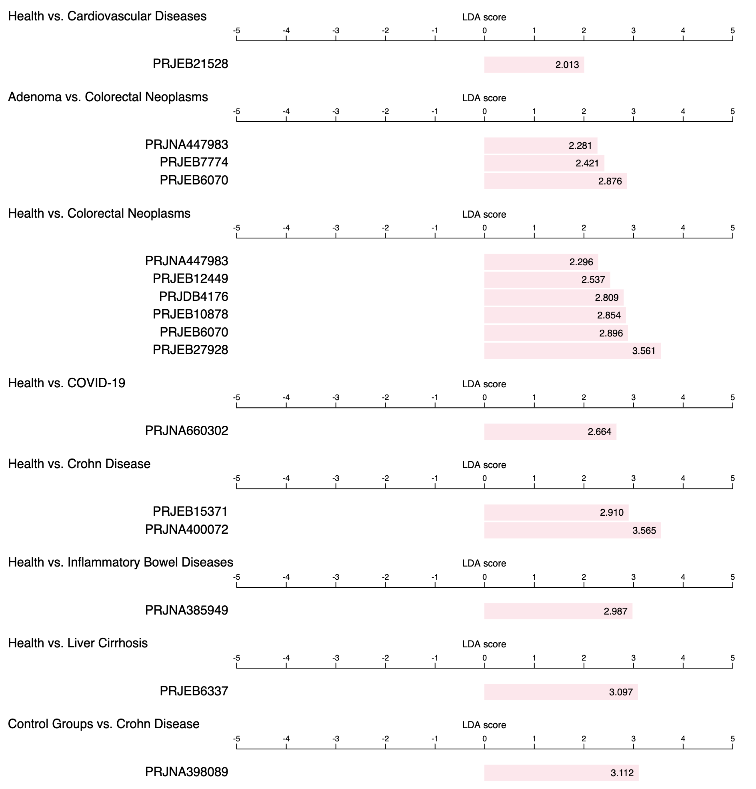
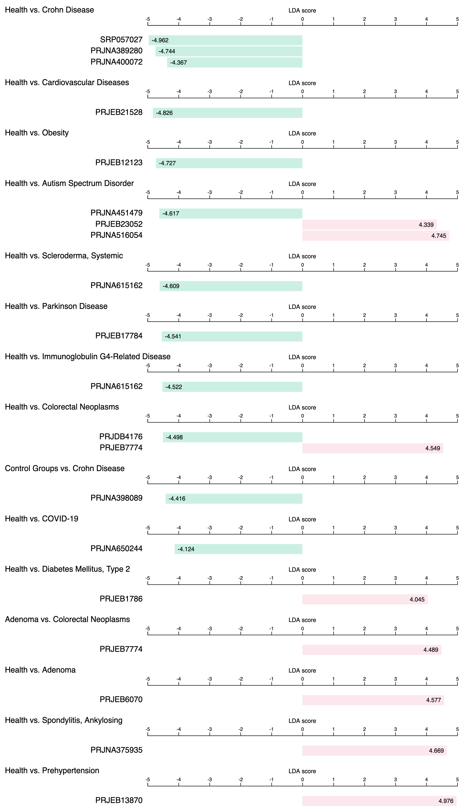
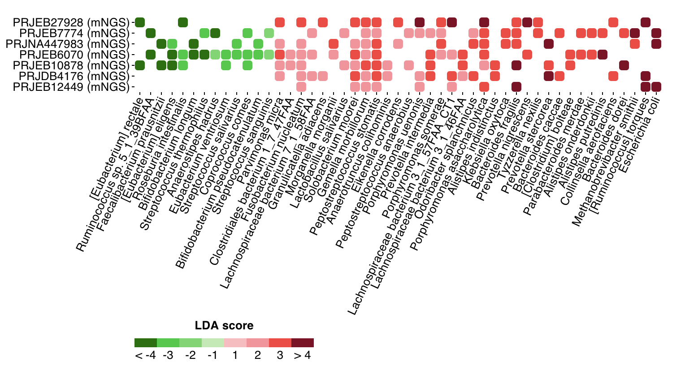
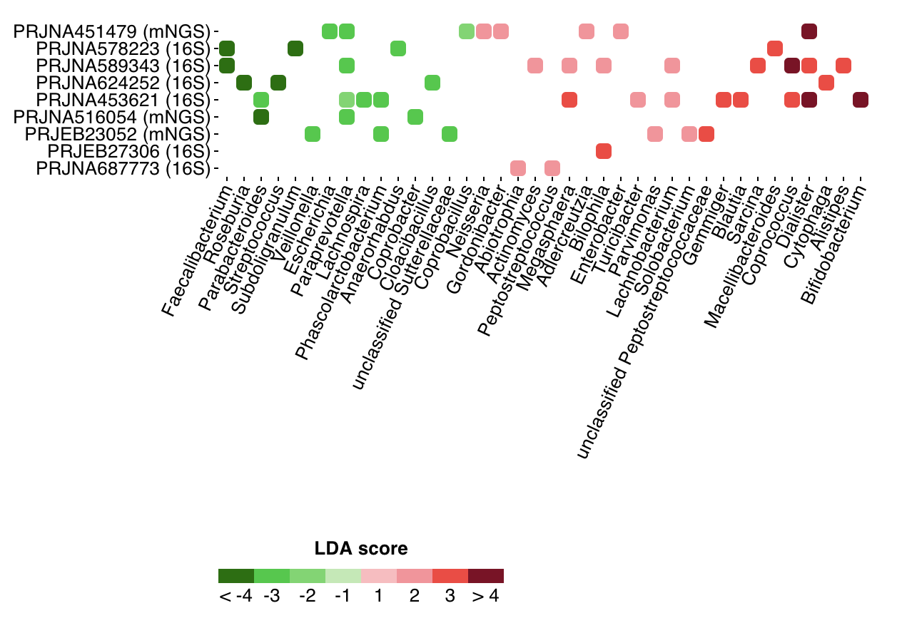

# Cross-project comparisons for disease markers

<b>GMrepo</b> currently supports two types cross-project comparisons for disease markers, see details below

## Cross-project and phenotype comparison for a maker taxon

This purposes of this comparison are to show if a specific taxon:

* is unique to a disease, or shared by multiple diseases,
* has the same trend across diseases (e.g., always enriched in disease- or health- associated samples), or different trends in different diseases,
* has the same trend in multiple project of the same disease, or conflicting trends in different projects of the same diseases.

Here we use two examples to explain what the `above purposes` mean.

### 1. [<i>Fusobacterium nucleatum</i> :octicons-link-16:](https://gmrepo.humangut.info/taxon/851)

<i>F. nucleatum</i> is a known marker for colorectal cancer (CRC). In <b>GMrepo</b>, we show that it is also a marker for multiple diseases, including:

* Crohn Disease,
* COVID-19,
* Cardiovascular Diseases,
* Inflammatory Bowel Diseases, and
* Liver Cirrhosis

{ width=100%; }

In addition, it shows consistent trends as a `disease-enriched` marker:

* not only across all above diseases,
* but also across multiple projects of the same diseases, including
  * Crohn Diseases, and 
  * Colorectal Neoplasms (CRC).

### 2. [<i>Prevotella copri</i> :octicons-link-16:](https://gmrepo.humangut.info/taxon/165179)

<i>P. copri</i> is also a marker species for multiple diseases:

{ width=100%; }

However, it shows inconsistent trends not only in different diseases (e.g., enriched in `Adenoma` but depleted in `Crohn Diseases`), but also in different projects in the same disease (e.g., in `Autism Spectrum Disorder` and `Colorectal Neoplasms`).

## Marker taxa of a disease across multiple projects

In <b>GMrepo</b>
, a disease could be covered by multiple datasets/projects. To facilitate cross-project comparisons of the identified markers within each project, a dedicated page for each phenotype pair (e.g., health versus liver cirrhosis, or adenoma versus colorectal cancer) is available to systematically show the consistent and non-consistent disease-associated microbial markers across datasets. 

Users can check the [Phenotype comparisons page :octicons-link-16:](https://gmrepo.humangut.info/phenotypes/comparisons) for all available `phenotype pairs`. 

Below we will use two example to show consistent and inconsistent disease markers across projects.

### 1. [Colorectal Newplasms (CRC) :octicons-link-16:](https://gmrepo.humangut.info/phenotypes/comparisons/D006262/D015179)

In addition to details of the related projects and a data table of identified marker taxon for `CRC` (as compared with healthy controls), a `tile view` is used to visualize all markers stratified by projects:

{ width=100%; }

Shown here are microbial markers across the seven projects; it is evident that disease-enriched markers are consistent across projects, including known CRC marker species <i>Fusobacterium nucleatum</i>, <i>Parvimonas micra</i> and <i>Gemella morbillorum</i>.

### 2. [Autism Spectrum Disorder (ASD) :octicons-link-16:](http://gmrepo2018.local/phenotypes/comparisons/D006262/D000067877)

Shown below are markers of ASD (as compared with healthy controls) in 9 projects:

{ width=80%; }

only very few markers can be found in mulple projects.
