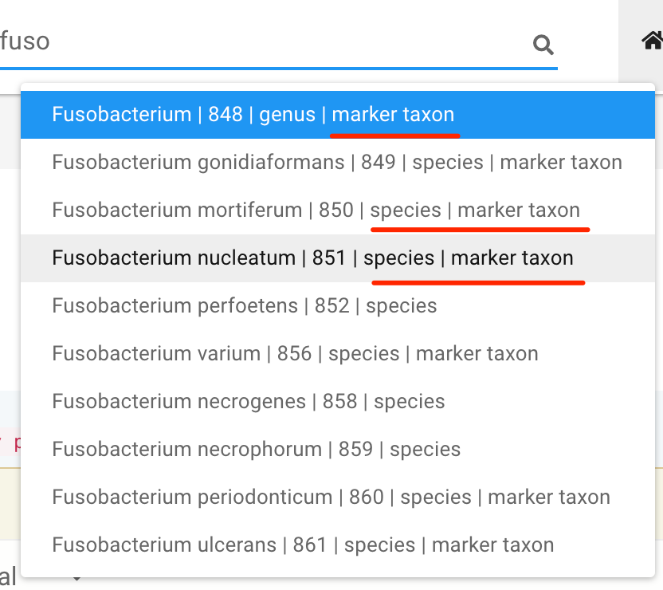
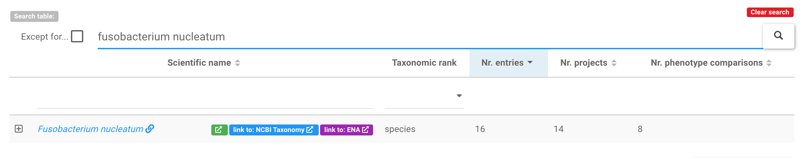

# Find a marker species/genus of interests

There are at least two ways to find a marker taxa of interest.

## 1. Use the global search widget

A global search widget is available on the navigation bar next to the <b>GMrepo</b> logo:

{ width=60%; }

Possible hits will be shown automatically in a dropdown list when users enter three and more characters:

{ width=40%; }

Those marked as `marker taxon` at the end are `marker taxa`. Users can then select any item from the list, and to the `marker taxon` of interest. 

!!! note
    * the search is automatic, so there is no need to press the <code>enter</code> key or click the :fontawesome-solid-search: icon;
    * <code>nothing will be shown</code> if no search results can be found in our database.

## 2. Search in the [Marker taxa :octicons-link-16:](https://gmrepo.humangut.info/taxon/markertaxa) webpage

Users can first go to the [Marker taxa :octicons-link-16:](https://gmrepo.humangut.info/taxon/markertaxa), and search in the <code>Species</code> or <code>Genus</code> tables:

{ width=100% }

!!! tip
    Valid search term include:

    * scientific name, for example `fusobacterium`
    * NCBI taxonomic ID, for example `851`
