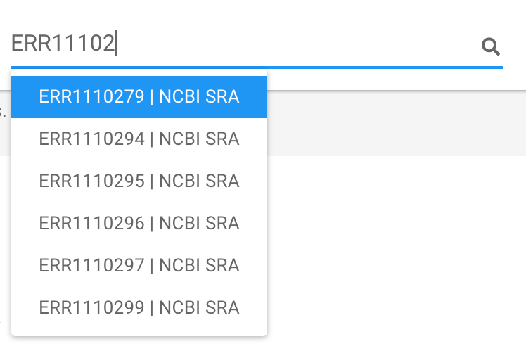

# find a run (sample) or runs (samples) of interest

There are at least two ways to find a project or projects of interest.

## 1. Use the graphical data selector

Please [consult here :octicons-link-16:](graphicdataselector.md) for the documentation.

## 2. Use the global search widget

A global search widget is available on the navigation bar next to the <b>GMrepo</b> logo:

{ width=60%; }

Possible hits will be shown automatically in a dropdown list when users enter three and more characters:

{ width=40%; }

Users can then select any item from the list, and to the `run/sample` of interest. 

!!! tip
    Valid search term include:

    * NCBI/ENA run/sample ID, for example `ERR111`

!!! note

    * the search is automatic, so there is no need to press the <code>enter</code> key or click the :fontawesome-solid-search: icon;
    * <code>nothing will be shown</code> if no search results can be found in our database.
