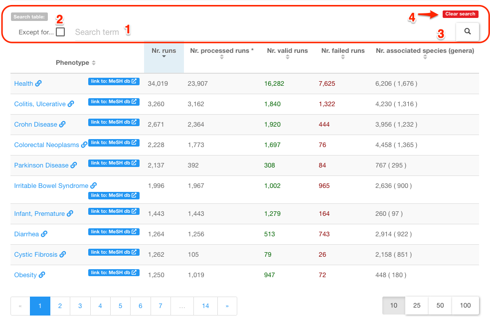
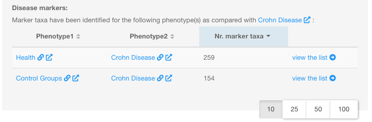
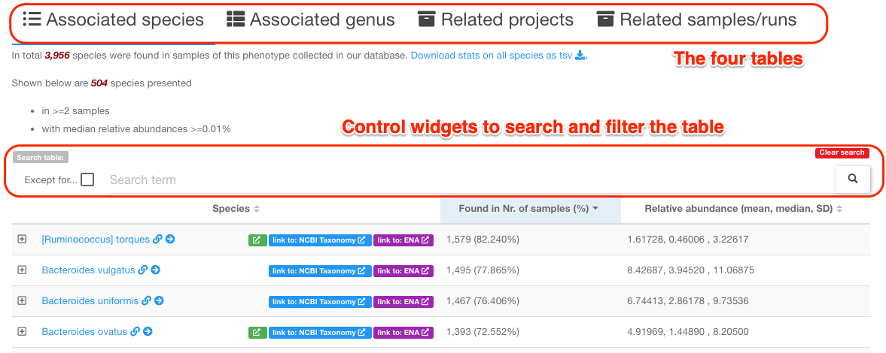
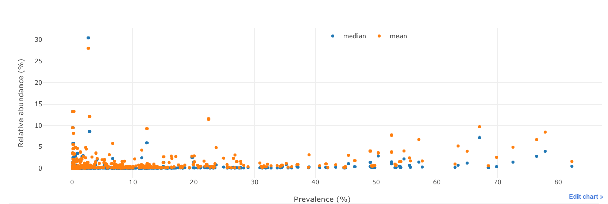
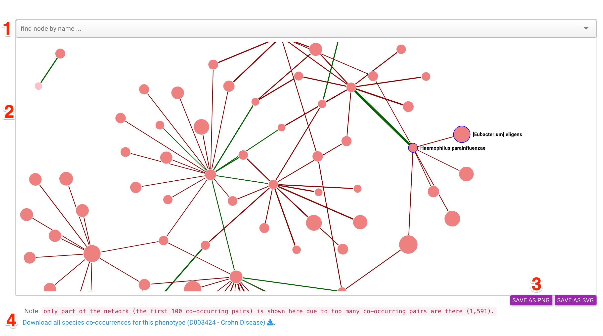
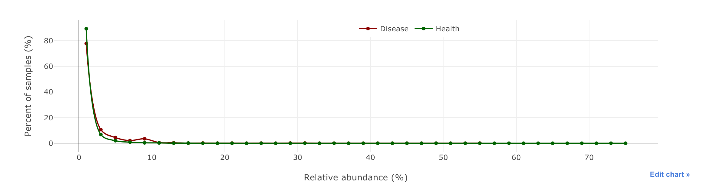
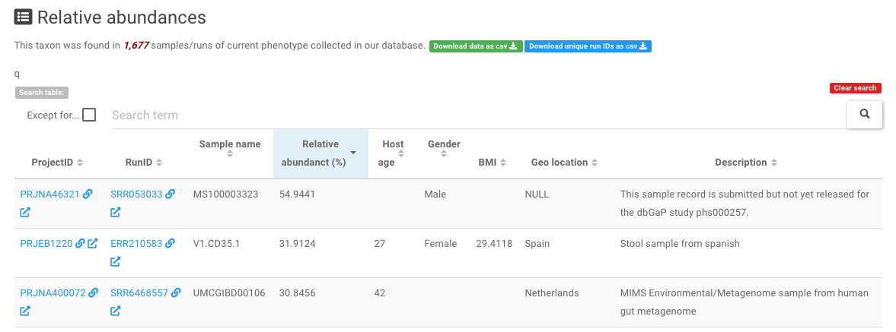
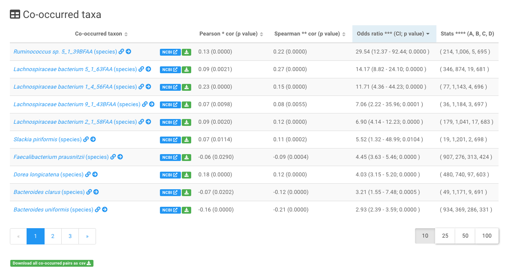

# Disease centric pages

There are in total **three** types of disease centric web pages :fontawesome-solid-book-open: that are designed to present disease related information, which are detailed below:

## :fontawesome-solid-book-open: [Phenotypes (diseases and health) page :octicons-link-16:](https://gmrepo.humangut.info/phenotypes)

This page lists all diseases that have been assocaited with the alterations of gut microbes.

Its main contents is a table that lists statistics of 131 diseases collected in our database, see the screenshot below:

In addition to the data table, several control widgets are available on the top of the table (marked by the red box). Users can use them to find information in the table that they are interested in. 

!!! note "Widgets to filter the table contents"
    The widgets in the above screenshot are:

    1. filter the table using <code>user supplied</code> key words;
    
    2. filter the contents of the table that DO NOT contain the <code>user supplied</code> key words;
    
    3. do filtering;
    
    4. clear searching results and reset the table

Click any one of the disease names, users will be redirected to the corresponding page dedicated to disease-gut microbe associations.

## :fontawesome-solid-book-open: Gut microbes associated with a specific disease

This page is used to decribe in details of gut microbiota data associated with a specific disease. 

This page typically consists of four sections. Below the [Crohn Disease :octicons-link-16:](https://gmrepo.humangut.info/phenotypes/D003424) page is used as an example.

### 1. Overview of <code>Crohn Disease</code> associated gut microbiota data

This section first gives a brief description of the disease (or health) according to the MeSH (Medical Subject Headings) database, then summarises the: 

* number of related projects;
* number of total runs in the related projects;
* number of processed runs, whose raw sequence data have been downloaded, quality checked and analyzed;
* number of valid runs that passed our [quality control procedures :octicons-link-16:](../materialsandmethods/dataprocessingandqc.md#quality-control).

### 2. Overview of disease markers

This section uses a table to list the numbers of marker taxa identified between:

* either <code>Crohn Disease</code> and controls,
* or two stages of <code>Crohn Diseases</code> (if there are any).

See the screenshot below:

!!! note
    * 'Control Groups' and 'Health' are two MeSH IDs commonly used to describe control samples. The main difference between the two is that 'Health' refers to individuals who do not have any detectable dieases, while 'Control Groups' refers to those who do not have the disease of interest, for example 'Crohn Disease' in this case. Thus, in this case the 'Control Groups' also refers to the non-'Crohn Disease' group.
    * the **'Nr. marker taxa'** column reports the total number of markers at both genus and species levels. If marker taxa have been identified in multiple projects for the same phenotype pair (e.g., Crohn Disease vs. health), the uniuqe number of all the markers will be reported.

### 3. Four tables list associated species, genera, projects and runs

This section contains **four tables** that list:

* species that were identified from the valid runs associated with the disease (<code>Crohn Disease</code> in this example), and their prevalences and abundances in the valid runs;
* genera that were identified from the valid runs associated with <code>Crohn Disease</code> , and their prevalences and abundances in the valid runs;
* related project IDs, descriptions and publications (if there is any);
* related runs and their QC statuses. 

Each table is equipped with a set of control widgets allowing users to search the table and filter the rows accordingly.

See the screenshot below:

### 4. a dot plot summarises taxon abundances as a function of prevalence

As shown below:

Each dot represents a taxon (species or genus).

!!! note
    * **Prevalence**: proportion of samples in which a species/genus is found above certain abundance threshold (e.g. 0.01%).
    * **Abundance**: mean/median relative abundance of a species in all samples of a phenotype (e.g., <code>Crohn Disease</code>).

### 5. a network plot of co-occurred taxa

Below is a screenshot of the network and its control widgets:

!!! info "The four main components of the screenshot"
    1. a search widget allows uses to find species or genus of interests in the network; it is also a droplist that allows users to select the species/genus in the network. The plot will center on the node when it is selected.

    2. the taxon co-occurrence network. See details below.

    3. buttons to save the network to external files in either PNG or SVG format.

    4. a link to download the pair-wise interaction relationships and other relavent information as a text file.

!!! info "The network"
    Here the **nodes** refer to : species or genera co-occurred with others in samples of this phenotype; the sizes are proportional to the number of connected nodes in the network.

    **The links** refer to : co-occur relationships between species or genera; the widths are proportional to the absolute value of the correlation coefficient (Pearson correlation), while the colors indicate positive (green) or negative (red) correlations.

!!! info "The co-occurrence between two taxa"
    Two taxa (i.e., either two species or genera) will be considered as **co-occurred** in the disease (<code>Crohn Disease</code>) associated samples if they meet **all** the following criteria:

    1. a <code>Fisher's exact test</code> was used to calculate the odds of the two taxa to co-occur in the disease associated samples/runs based on their **presence**/**absence** information. A taxon was considered as **present** in a sample/run if its relative abundance was higher than 0.01%. A p-value and odds ratio (OR) were reported for each pair. The pair with p-value < 0.05 was selected. The <code>fisher.test()</code> function implemented in **R** was used.

    2. <code>Peasrson</code> correlation analysis was applied to the relative abundances of the two taxa in the disease associated samples. The pair with a p value < 0.05 was selected.

    3. <code>Spearman</code> correlation analysis was applied to the relative abundances of the two taxa in the disease associated samples. The pair with a p value < 0.05 was selected.

!!! note "Usage of the network plot"
    * <code>mouse over a node</code> to a) highlight the node and its direct neighbors, and b) show the names of the node and its direct neighbors;

    * <code>click a node</code> to highlight it and its direct neighbors
    * <code>click a node and move it around </code>to fade other nodes and edges;
    * <code>click the text label</code> of a node to show the association details in a new window;
    * <code>double-click a node</code> to move it to the canvas center;
    * <code>double-click the canvas</code> to zoom in;
    * <code>use mouse wheel</code> to zoom in and out of the whole plot;
    * <code>use the selector</code> on the top of the plot to find a node of interest and move it to the view center.

## :fontawesome-solid-book-open: Association beteen a taxon and a disease

This page shows the distributions of a taxon (at species or genus level)  in samples associated with a specific disease. Here we use the [association between <b><i>[Ruminococcus] torques</i></b> and <code>Crohn Disease </code> :octicons-link-16:](https://gmrepo.humangut.info/phenotypes/D003424/33039) as an example to explain the contents and organization of this page.

This page consists of four secdtions:

### 1. Overview of the association

This part contains:

* a brief description of this disease in the MeSH database;
* statistics on associated projects and runs
* statistics on the prevalence of <i>[Ruminococcus] torques</i> in disease associated samples;

This part also contains links to other pages in GMrepo:

* all dieases associated with the taxon,
* all gut microbes at species and genus levels associated with <code>Crohn Disease </code>,

and links to external databases, including:

* [NCBI taxonomic database :octicons-link-external-16:](https://gmrepo.humangut.info/species/33039){:target="_blank"}, and 
* [MVP database for phage and bacterium associations :octicons-link-external-16:](http://mvp.medgenius.info/microbes/33039/[Ruminococcus]%20torques){:target="_blank"} (if there is any).

### 2. graphical representation of the association

This part includes two plots,

<b>a histogram</b>

and <b>a box plot</b>

showing the distribution of the relative abundances across Crohn Disease associated samples.

!!! tip
    For comparison, the abundance distributions of the taxon (<i>[Ruminococcus] torques</i>) in all healthy samples will also be displayed.

### 3. Relative abundance details of this taxon

This part contains a list of <code>Crohn Disease</code> associated samples in which <i>[Ruminococcus] torques</i> can be found. As shown below, in addition to the relative abundance values of <i>[Ruminococcus] torques</i>, meta-data of the samples are also shown, including age, gender and BMI information of the associated patients.

!!! tip
    1. users can download the data as a text file using the "Download data as csv" button above the table;
    2. search widgets are available for users to search and filter the contents of this table.

### 4. Taxa co-occurred with <i>[Ruminococcus] torques</i> in <code> Crohn Disease</code> associated samples

The co-occurred taxa were identified using methods and criteria described in the <b>co-occurrence between two taxa</b> section above.

!!! tip
    users can download the data as a text file using the "Download all co-occurred pairs as csv" button below the table.
