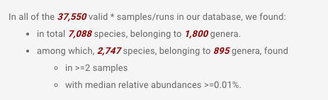
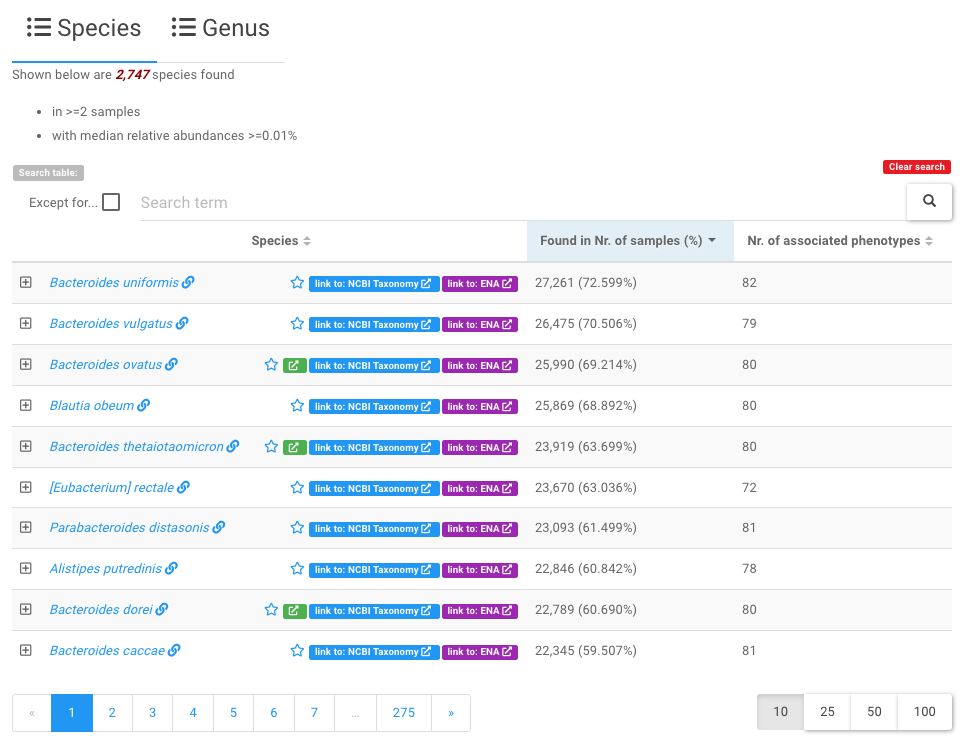
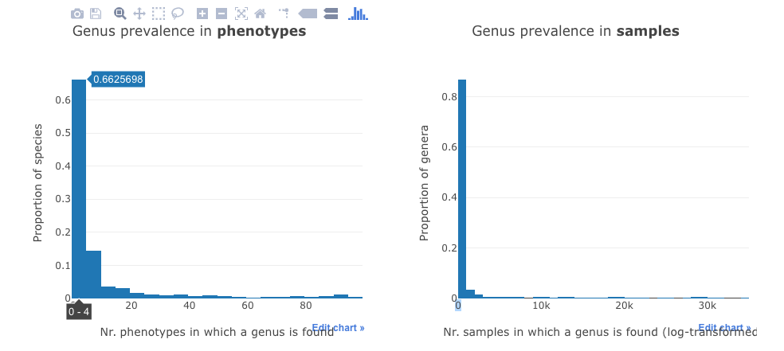
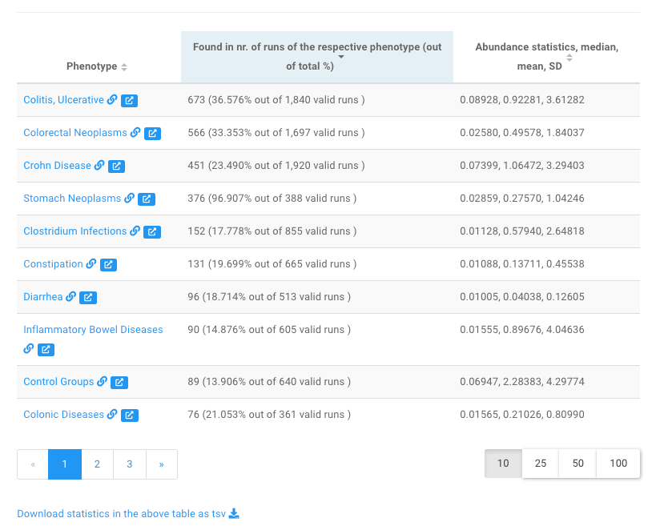
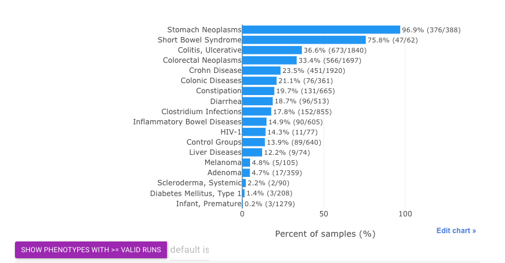
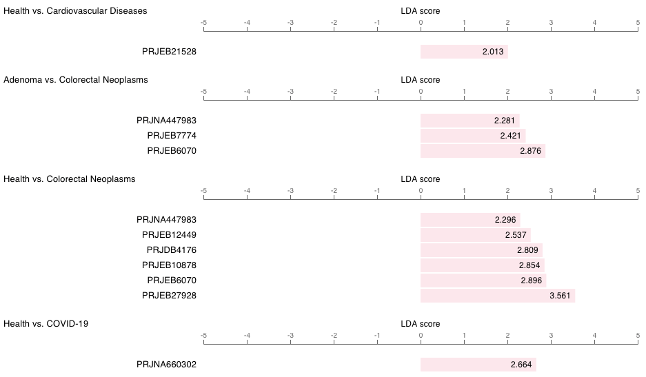

# Gut microbe centric pages

Similar to [disease centric pages :octicons-link-16:](../diseasecentricpages), there are **two types** of gut microbe centric webpages :fontawesome-solid-book-open:, i.e., the information are organized around the microbe(s), including:

* the [gut microbes page :octicons-link-16:](https://gmrepo.humangut.info/taxon) that lists all gut microbes identified in the qualified samples collected in <b>GMrepo</b>,

* the [single taxon page :octicons-link-16:](https://gmrepo.humangut.info/taxon/820) that lists its associated diseases and distributions across diseases. If a taxon is a disease marker, the relavent information will also be included.

These pages will be described in details below.

## :fontawesome-solid-book-open: [All gut microbes :octicons-link-16:](https://gmrepo.humangut.info/taxon)

This page lists all gut microbes at species and genus levels included in <b>GMrepo</b>. It consists three sections.

### 1. Overview

This part provides simple statistics on the gut microbes collected in our database, for example:

### 2. Lists of all gut microbes

This part contains two data tables that list all gut microbes at species and genus levels respectively, and their associated phenotypes (i.e., diseases and health).

Users can click any of the taxa to view [all relavent informatin of the taxon in our database in more details :octicons-link-16:](#all-data-of-a-specific-taxon).

!!! tip
    * Because there are so many identified species (genera), this table lists a subset of which that are found in two and more samples with median relative abundances >=0.01%;
    * Users can use the widgets above the data table to search and filter the contents of the table. For example, users can enter a search term <code>Bacteroides</code> to find all species that contains <b>Bacteroides</b> in their names.

!!! note
    * a star symbol :fontawesome-regular-star: next to taxon names indicates marker taxon, which shows signficantly differential abundances between two phenotype types, e.g. health vs. disease. See the [marker taxon page :octicons-link-16:](diseasemarkerpages.md) for details. 

### 3. Statistics on taxon prevalence in phenotypes and samples

This part contains two histograms.

The first shows the distribution of the taxa in the phenotypes, while the second shows distribution of all the taxa in the samples.

For example, the first bar in the left panel means that about **66% of all species** are found in **four or less (0-4) phenotypes**.

## :fontawesome-solid-book-open: Detailed information on a specific taxon

This webpage contains almost all information on a taxon in our database, including:

* its association with dieases,
* its prevalence and abundances across diseases,
* whether it is a marker, in how many diseases it serves as a marker and its trends (i.e., enrichment and depletion) in diseases and healthy controls.

Here we use [<code>Fusobacterium nucleatum</code> :octicons-link-16:](https://gmrepo.humangut.info/taxon/851) as an example to show the contents of this page. 

### 1. Overview 

This part summarises very briefly the number of runs in which <code>Fusobacterium nucleatum</code> can be found, and the number phenotypes (diseases and health) it associated with. 

It also includes links to external databases, including 

* [NCBI taxonomic database :octicons-link-external-16:](https://gmrepo.humangut.info/species/33039){:target="_blank"}, and 
* [MVP database for phage and bacterium associations :octicons-link-external-16:](http://mvp.medgenius.info/microbes/33039/[Ruminococcus]%20torques){:target="_blank"} (if there is any).

### 2. Stats on associated phenotypes

This part contains a table and a barplot.

The table lists the associated diseases and the prevalence of <b><i>Fusobacterium nucleatum</i></b> in the corresponding disease-associated samples. 

Users can click a disease name, e.g., <code>Crohn Disease</code> to view [more information on gut microbes associated with the disease in our database :octicons-link-16:](https://gmrepo.humangut.info/phenotypes/D003424).

The barplot shows basically the same statistics:

!!! tip
    * By default, phenotypes with more than <code>50 valid runs</code> will be included in this barplot.
    * Users may increase/decrease this threshold using widgets above.
    * Here <code>prevalence</code> is defined as percentage of runs in which current taxon is present (w/ relative abundance >= 0.01%) out of valid runs.

### 3. Relative abundances of the taxon in different diseases and healthy samples

The relative abundances of the taxon across diseases and health are shown in:

* a density plot, and 
* a boxplot.

See [here for an example :octicons-link-16:](https://gmrepo.humangut.info/taxon/851).

### 4. Marker taxon

[Please consult the marker identification documentation for more details on how markers are identified :octicons-link-16:](/materialsandmethods/indepthanalyses).

!!! note
    The markers are identified on per-project basis, and between 
    
    * either a disease and health (e.g., colorectal cancer (CRC) vs. healthy controls), 

    * or different stages of the same disease (e.g., CRC and adenoma).

In <b>GMrepo</b>,
marker information in this microbe-centric page are presented using a table and a barplot.

As shown below is the barplot view of [<code>Fusobacterium nucleatum </code> as a marker taxon :octicons-link-16:](https://gmrepo.humangut.info/taxon/851):

!!! note
    * From this plot we can see that <i><code>F. nucleatum </code></i> has been identified as a marker in many diseases;
    * It shows consistent enrichment in diseases as compared with healthy controls, and in more advanced disease stages (e.g., adenoma vs. CRC);
    * It also shows consistent trend in multiple projects related to the same disease (e.g., Colorectal Neoplasms (CRC)).
