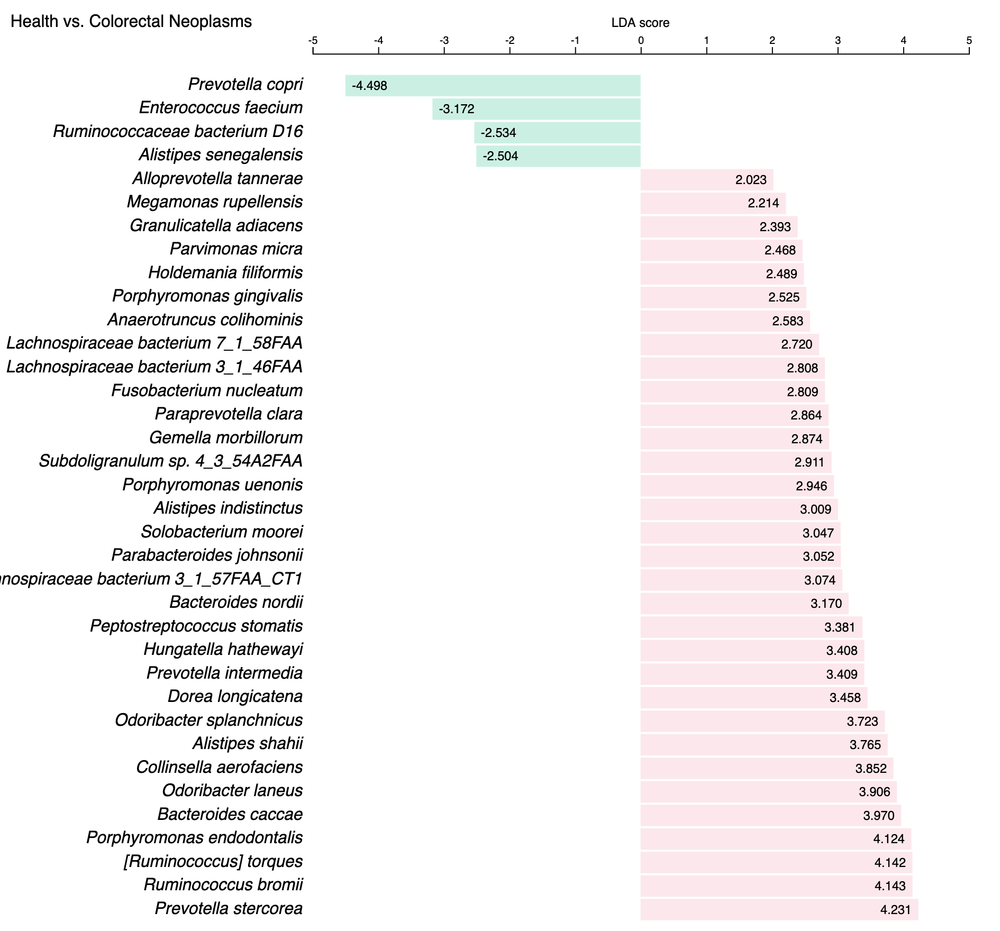

# Projects and runs

The <code>projects and runs</code> webpages can be found from the 
**:fontawesome-solid-database: Data** menu, the latter contains two submenus, one for [:fontawesome-solid-database: all projects and runs :octicons-link-16:](https://gmrepo.humangut.info/data), the other is for [:fontawesome-solid-check-double: curated projects :octicons-link-16:](https://gmrepo.humangut.info/data/curatedprojects).

There are four types of :fontawesome-solid-book-open: webpages for <code>projects and runs</code>. 

## [:fontawesome-solid-book-open: All projects and runs :octicons-link-16:](https://gmrepo.humangut.info/data)

This page provides statistics on the data collected in <b>GMrepo</b>, and lists all **projects** and **runs** in two tables, from the tables users can access webpages for details of a specific project or run.

It thus consists three parts:

### 1. Overview

This parts provides overview of data collected in our database. For example, the current release contains:

* Meta data for in total 71,642 runs (samples), belonging to 353 projects.
Among which, raw data have been processed for in total 53,700 runs (samples), belonging to 282 projects.
* Among which, microbe abundance data are available for in total 37,550 runs (samples), belonging to 209 projects.
* In total 16,150 runs (samples), belonging to 159 projects failed our QC processes.
* In addition, <b>GMrepo</b> also includes information on 76 projects whose raw data were not processed, including in total 31,381 runs/samples, due to various reasons, mostly the lack of a clearly defined health/disease information.

### 2. All projects table

This table contains a list of collected projects, their associated diseases, related publications, brief descriptions and whether the rawdata have been processed.

The rawdata of a project will not be processed if it lacks certain essential meta-data. For example, <b>GMrepo</b> currently contains 76 projects whose raw data were not processed, correspondin to in total 31,381 runs/samples, due to various reasons, mostly because of the lack of phenotype information; uses can click the project id for details.

For example, project [PRJNA682076 :octicons-link-16:](https://gmrepo.humangut.info/data/project/PRJNA682076) contains <code>666</code> samples/runs; it was not processed because host-related information were not available, including the <code>disease/heath information, age, gender and BMI</code>.

### 3. All runs table

This table contains a list of collected samples in <b>GMrepo</b>. Also available are meta-data including:

* technical meta-data such as:

  * experiment type (16S or Metagenomics),
  * sequencing devices / instruments, and
  * number of obtained sequencing reads.

* Host-related, biological-relevant meta-data such as: 

  * disease or health of the host (refered as to <code>phenotype</code> in our database),
  * age,
  * sex,
  * BMI (body mass index), and
  * antibiotic usage.

Meta data are available for in total <code>71,642</code> runs/samples.

A QCStatus (quanlity-control result) is available for each run, which can be one of the three values:

* 1: the data passed our QC procedure and the processed results (i.e., taxnomic assignments) have been loaded into our database,
* 0: the data did NOT pass our QC,
* (empty): data yet to be proccessed and loaded to our database.

Please consult [Data processing & QC :octicons-link-16:](/materialsandmethods/dataprocessingandqc/#quality-control) for more details.

## :fontawesome-solid-book-open: project details page

The project details page is available for each collected project in <b>GMrepo</b>, and provides details on a project, including:

* included samples,
* associated disease(s),
* related publication(s), and
* disease marker analysis results

Here are some random examples:

* [PRJEB1220 :octicons-link-16:](https://gmrepo.humangut.info/data/project/PRJEB1220)
* [PRJEB6337 :octicons-link-16:](https://gmrepo.humangut.info/data/project/PRJEB6337)
* [PRJEB6070 :octicons-link-16:](https://gmrepo.humangut.info/data/project/PRJEB6070)

### 1. Project overview

This part provides some basic information regarding a project, including:

* a brief project description obtained from public databases, mostly from [ENA (European Nucleotide Archive) :octicons-link-external-16:](https://www.ebi.ac.uk/ena/browse){:target="_blank"} or [NCBI SRA (Sequence Read Archive) database :octicons-link-external-16:](https://www.ncbi.nlm.nih.gov/sra){:target="_blank"},
* number of included runs,
* related publication(s), if available,
* whether the project is a [:fontawesome-solid-check-double: curated project :octicons-link-16:](https://gmrepo.humangut.info/data/curatedprojects).

### 2. Included runs/samples

This part includes a table that contains a list of runs/samples included in the project. Similar to the <code>All runs table</code>, related technical and biological meta-data and QCStatus are also listed in the table. Please consult the <code>All runs table</code> section above for more details.

### 3. In-depth analysis

<code>In-depth analysis</code> so far includes only <code>marker identification</code>. Please consult our documentation on [Disease marker identification :octicons-link-16:](/materialsandmethods/indepthanalyses) for more details.

Briefly, microbial markers that show significantly differential abundances between:

* either a disease and the healthy control group, e.g., CRC and health,
* or two distinct stages of a disease, e.g., adenoma and CRC

are identified using <code>LEfSe (Linear discriminant analysis effect size)</code>
[PMID: 21702898  :octicons-link-external-16:](https://www.ncbi.nlm.nih.gov/pubmed/21702898){:target="_blank"}.

In <b>GMrepo</b>, markers are identified on per-project basis, thus the analysis results are included in this <code>project details</code> for each project.

In addition to be shown in a data table, the LEfSe results are also visualized in a barplot, as shown below:

this plot shows marker species that show <code>|LDA score| >= 2.0</code> between <code>CRC and healthy controls</code> in project [PRJDB4176 :octicons-link-16:](https://gmrepo.humangut.info/data/project/PRJDB4176), in which green (pink) bars indicate health(CRC)-enriched species. 

!!! note
    * for whole-genome shortgun sequencing (a.k.a mNGS) projects, markers were identified at both <code>species</code> and <code>genus</code> levels;
    * for 16S amplicon data (a.k.a 16S) projects, markers were identified at only <code>genus</code>.
    * users can choose to show either <code>species</code> or <code>genus</code> level markers, or both, by using the <code>control buttons</code> above the barplot.

## :fontawesome-solid-book-open: Run details page

This page shows details of a specific run, and includes two parts.

### 1. Run details and meta-data

This part includes:

* run ID,
* a brief introduction,
* related project ID and sample ID,
* associated disease, and 
* meta-data

### 2. Taxonomic profile

This part shows the taxonomic profile, i.e., the bacterial species/genus identified in the run and their relative abundances. 

See [ERR481097 :octicons-link-16:](https://gmrepo.humangut.info/data/run/ERR481097) for an example.

The relative abundances are visualized as below:

Users can download the detailed profile as a text file using the link below the figures.

